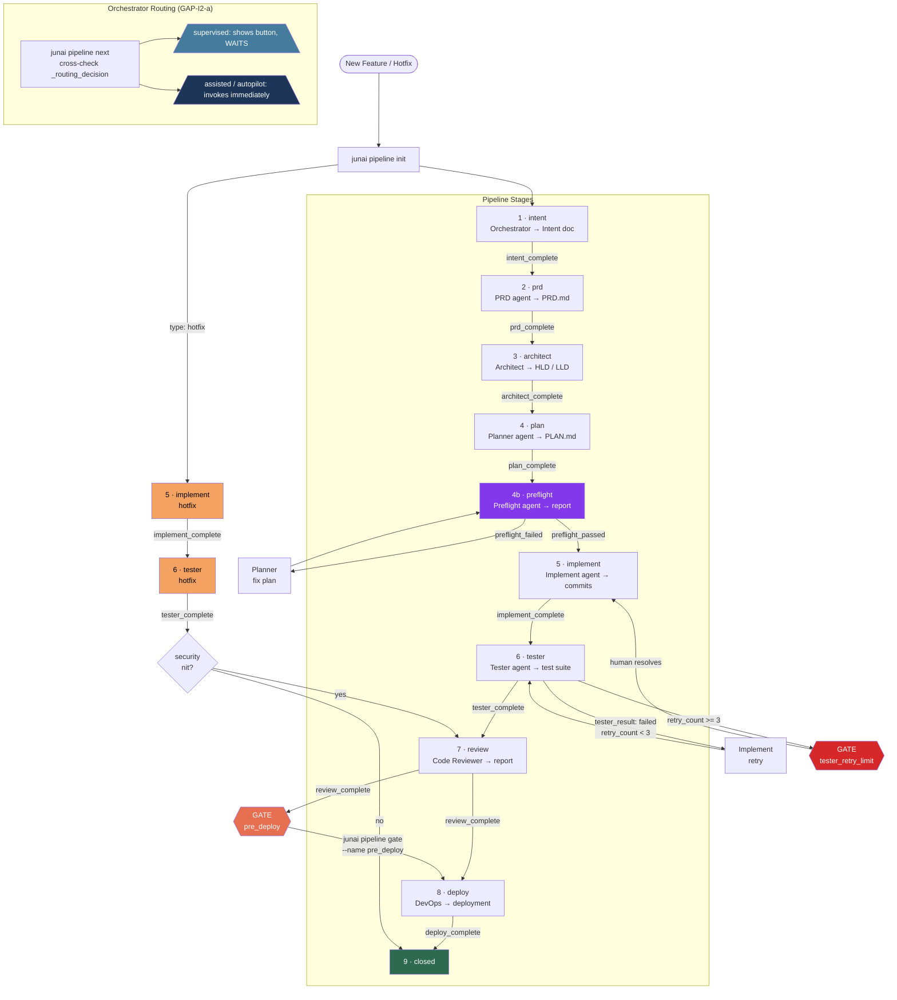

```mermaid
flowchart TD
    START([New Feature / Hotfix]) --> INIT[junai pipeline init]
    INIT --> INTENT

    subgraph PIPELINE ["Pipeline Stages"]
        direction TB
        INTENT["1 · intent\nOrchestrator → Intent doc"]
        PRD["2 · prd\nPRD agent → PRD.md"]
        ARCH["3 · architect\nArchitect → HLD / LLD"]
        PLAN["4 · plan\nPlanner agent → PLAN.md"]
        PREFLIGHT["4b · preflight\nPreflight agent → report"]
        IMPL["5 · implement\nImplement agent → commits"]
        TEST["6 · tester\nTester agent → test suite"]
        REVIEW["7 · review\nCode Reviewer → report"]
        DEPLOY["8 · deploy\nDevOps → deployment"]
        CLOSED["9 · closed"]

        INTENT -->|intent_complete| PRD
        PRD    -->|prd_complete| ARCH
        ARCH   -->|architect_complete| PLAN
        PLAN   -->|plan_complete| PREFLIGHT
        PREFLIGHT -->|preflight_passed| IMPL
        IMPL   -->|implement_complete| TEST
        TEST   -->|tester_complete| REVIEW
        REVIEW -->|review_complete| DEPLOY
        DEPLOY -->|deploy_complete| CLOSED
    end

    %% Preflight fail loop
    PREFLIGHT -->|preflight_failed| PLAN_FIX["Planner\nfix plan"]
    PLAN_FIX --> PREFLIGHT

    %% Tester retry loop
    TEST -->|tester_result: failed\nretry_count < 3| IMPL_RETRY["Implement\nretry"]
    IMPL_RETRY --> TEST
    TEST -->|retry_count >= 3| GATE_TR{{"GATE\ntester_retry_limit"}}
    GATE_TR -->|human resolves| IMPL

    %% Hotfix fast-track
    INIT -->|type: hotfix| HF_IMPL["5 · implement\nhotfix"]
    HF_IMPL -->|implement_complete| HF_TEST["6 · tester\nhotfix"]
    HF_TEST -->|tester_complete| HF_REVIEW{"security\nnit?"}
    HF_REVIEW -->|yes| REVIEW
    HF_REVIEW -->|no| CLOSED

    %% Gate: pre_deploy
    REVIEW -->|review_complete| GATE_PD{{"GATE\npre_deploy"}}
    GATE_PD -->|junai pipeline gate\n--name pre_deploy| DEPLOY

    subgraph ORCHESTRATOR ["Orchestrator Routing (GAP-I2-a)"]
        direction LR
        CHK["junai pipeline next\ncross-check _routing_decision"]
        MODE_S[/"supervised: shows button, WAITS"\]
        MODE_A[/"assisted / autopilot: invokes immediately"\]
        CHK --> MODE_S
        CHK --> MODE_A
    end

    style CLOSED   fill:#2d6a4f,color:#fff
    style PREFLIGHT fill:#8338ec,color:#fff
    style GATE_TR  fill:#d62828,color:#fff
    style GATE_PD  fill:#e76f51,color:#fff
    style MODE_S   fill:#457b9d,color:#fff
    style MODE_A   fill:#1d3557,color:#fff
    style HF_IMPL  fill:#f4a261,color:#000
    style HF_TEST  fill:#f4a261,color:#000
```
