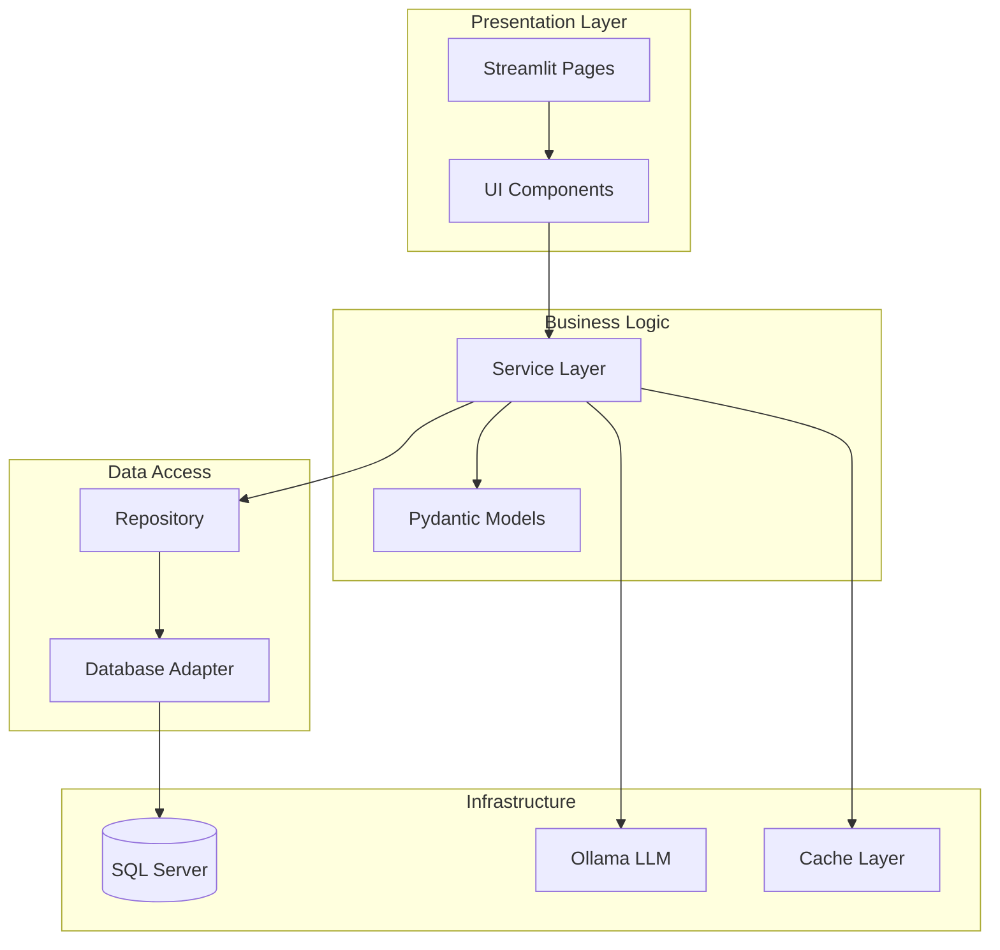
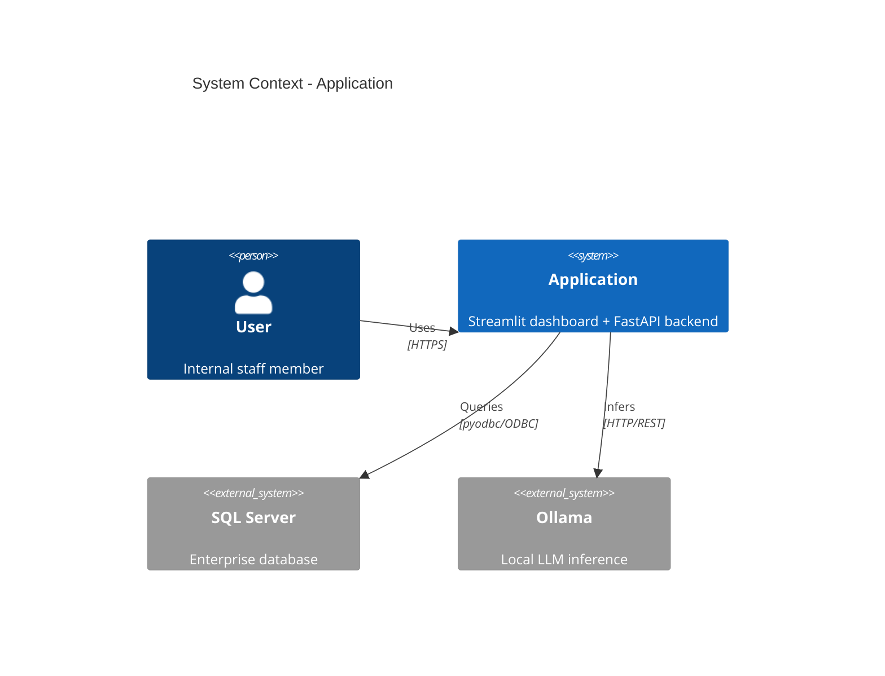
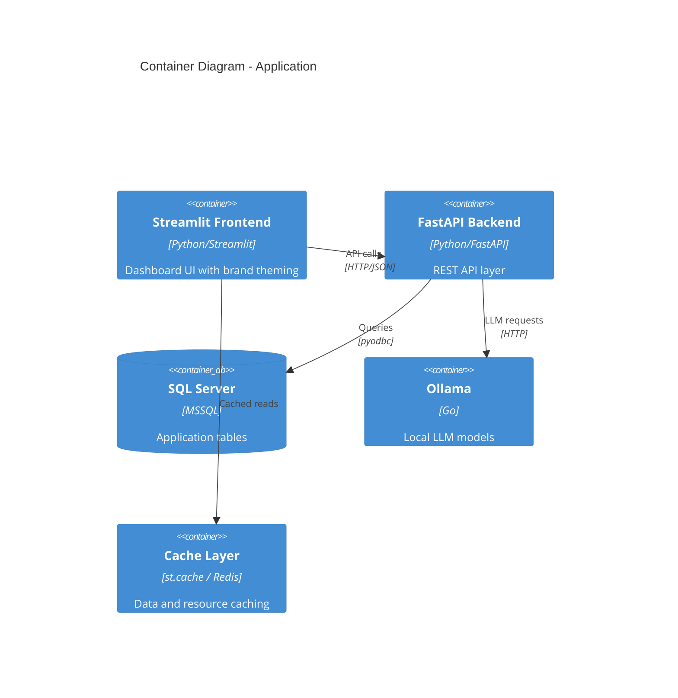

# Architecture Design

> **Project Context** — Read `project-config.md` in the repo root for brand tokens, shared-library paths, and deployment targets.

## When to Use

Invoke this skill when:
- Designing a new application or feature
- Creating architecture documentation for stakeholders
- Planning system integrations (Streamlit + FastAPI + SQL Server)
- Evaluating architectural trade-offs
- Creating C4 diagrams for project systems
- Reviewing NFRs (scalability, performance, security)
- Planning on-premise or air-gapped deployments

---

## Steps

### Step 1: Clarify Scope

Before designing, answer:
1. What system or feature is being designed?
2. Who are the users? (internal dashboards, external APIs, batch jobs)
3. What are the data sources? (SQL Server tables, APIs, files)
4. What are the deployment constraints? (on-premise, air-gapped, VPN)
5. What NFRs matter most? (latency, throughput, availability)

### Step 2: Define Layered Architecture

Applications follow a consistent layered pattern:

```
Pages → Components → Services → Repository → Adapter → Database
```



#### Component Responsibilities

| Component | Responsibility | Key Patterns |
|-----------|---------------|--------------|
| Pages | User interface, routing | `apply_page_config`, `render_header` |
| Components | Reusable UI elements | Streamlit widgets, Plotly charts |
| Services | Business logic, orchestration | Caching, validation, transformations |
| Repository | Data access facade | Query abstraction, `queries.yaml` |
| Adapter | Database communication | Parameterized queries, connection pooling |

### Step 3: Design File Structure

```
src/
├── pages/
│   └── {page}.py              # Streamlit page
├── components/
│   ├── shared_header.py       # Fixed header navigation
│   ├── kpi_cards.py           # KPI card components
│   └── {component}.py         # Feature-specific components
├── services/
│   ├── cached_repository.py   # Multi-user cached data
│   └── {service}.py           # Business logic
├── models/
│   └── {model}.py             # Pydantic models
├── ingestion_config/
│   ├── data_sources.py        # DB configuration
│   └── queries.yaml           # Externalized SQL queries
├── styles/
│   └── theme.css              # Brand theming CSS
└── utils/
    ├── dev_mode.py            # Query transparency
    └── paths.py               # Path management
```

### Step 4: Create C4 Diagrams

#### System Context Diagram



#### Container Diagram



### Step 5: Define NFRs

| Aspect | Approach | Project Specifics |
|--------|----------|-------------------|
| **Scalability** | Pagination, lazy loading | Application tables |
| **Performance** | Caching with TTL, query optimization | 15-min TTL for dashboards |
| **Security** | Parameterized queries, input validation | Windows Auth, regulatory compliance |
| **Maintainability** | Clear separation, type hints | Shared UI / data libraries |
| **Availability** | Error handling, graceful degradation | Air-gapped: no external dependencies |
| **Observability** | Loguru structured logging | On-premise log aggregation |

### Step 6: Document Design Decisions

| Decision | Options Considered | Choice | Rationale |
|----------|-------------------|--------|-----------|
| Frontend framework | React, Streamlit, Dash | Streamlit | Rapid development, Python-native, team expertise |
| Database access | ORM, raw SQL, repository | Repository + raw SQL | Performance control, query externalization |
| Caching | Redis, Memcached, st.cache | st.cache + optional Redis | Simple for Streamlit, Redis for FastAPI |
| LLM provider | OpenAI, Azure, Ollama | Ollama | Air-gapped requirement, data sovereignty |
| Deployment | Cloud, hybrid, on-premise | On-premise | Security requirements, existing infrastructure |

### Step 7: Identify Risks

| Risk | Impact | Likelihood | Mitigation |
|------|--------|------------|------------|
| SQL Server performance degradation | High | Medium | Query optimization, caching, pagination |
| Air-gapped dependency issues | Medium | Low | Vendor packages, local mirrors |
| Single point of failure (no HA) | High | Low | Graceful degradation, health checks |
| Data freshness vs cache staleness | Medium | Medium | Configurable TTL, cache invalidation |

---

## Patterns and Examples

### Architecture Decision Record (ADR) Template

```markdown
# ADR-001: [Decision Title]

## Status: Accepted

## Context
[What is the problem or situation requiring a decision?]

## Decision
[What was decided and why]

## Consequences
### Positive
- [Benefit 1]

### Negative
- [Trade-off 1]

### Neutral
- [Observation]
```

### Integration Pattern: Streamlit + FastAPI

```python
# Streamlit page calling FastAPI backend
import requests

BACKEND_URL = "http://localhost:8000"

def fetch_records(status: str = None, page: int = 1):
    params = {"page": page}
    if status:
        params["status"] = status
    response = requests.get(f"{BACKEND_URL}/records", params=params)
    response.raise_for_status()
    return response.json()
```

---

## Checklist

- [ ] System context diagram created (C4 Level 1)
- [ ] Container diagram created (C4 Level 2)
- [ ] Component responsibilities defined
- [ ] File structure planned
- [ ] NFRs documented with project-specific values
- [ ] Design decisions recorded with rationale
- [ ] Risks identified and mitigations planned
- [ ] Deployment strategy defined (on-premise/air-gapped)
- [ ] Integration patterns documented (Streamlit ↔ FastAPI ↔ SQL Server)
- [ ] Handoff ready: can create implementation plan from this design

## Related Resources

| Resource | Path |
|----------|------|
| Architect agent | `agents/architect.agent.md` |
| FastAPI dev skill | `skills/coding/fastapi-dev/SKILL.md` |
| Streamlit dev skill | `skills/frontend/streamlit-dev/SKILL.md` |
| SQL expert skill | `skills/coding/sql/SKILL.md` |
