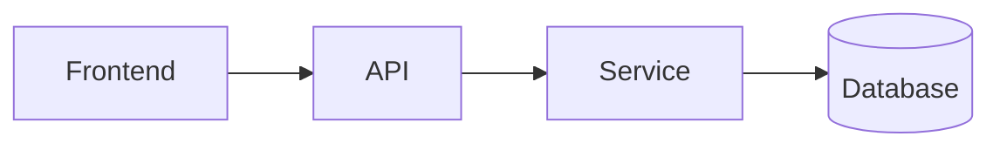

# Code Explainer Skill

When explaining code, always follow this structure:

## When to Use
- User asks "how does this work?"
- Explaining a codebase to a new team member
- Teaching a concept through code examples
- Creating code walkthroughs or tutorials

---

## Steps

### Step 1: Start with an Analogy

Compare code to everyday life:
- API endpoints -> Restaurant ordering (menu = endpoints, kitchen = backend)
- Database connections -> Library system (books = data, catalog = schema)
- Event loops -> Restaurant host managing reservations
- Caching -> Keeping frequent items on your desk
- Authentication -> Security guard checking IDs

### Step 2: Draw a Diagram

```
User Input -> Validation -> Processing -> Database -> Response
    ^                                              |
    +------------ Error Handling <-----------------+
```



### Step 3: Walk Through the Code

```python
# Step 1: User clicks submit -> triggers this function
def handle_submit(form_data):
    # Step 2: Validate (like a bouncer checking IDs)
    validated = validate(form_data)
    # Step 3: Process (like a chef preparing your order)
    result = process(validated)
    # Step 4: Save (like filing a document)
    save_to_db(result)
    # Step 5: Confirm (like getting a receipt)
    return success_response()
```

### Step 4: Highlight a Gotcha

Show common mistakes with before/after:
```python
# Wrong: mutable default argument
def add_item(item, items=[]):
    items.append(item)
    return items

# Fixed: use None
def add_item(item, items=None):
    items = items or []
    items.append(item)
    return items
```

### Step 5: Explain the Why

Don't just explain what, explain WHY:
- Why this pattern was chosen
- Why not simpler alternatives
- What problems this solves
- What trade-offs were made

---

## Checklist
- [ ] Analogy provided for complex concepts
- [ ] Visual diagram included (ASCII or Mermaid)
- [ ] Step-by-step walkthrough with comments
- [ ] Common gotcha highlighted
- [ ] "Why" explained (not just "what")
- [ ] Conversational tone used
