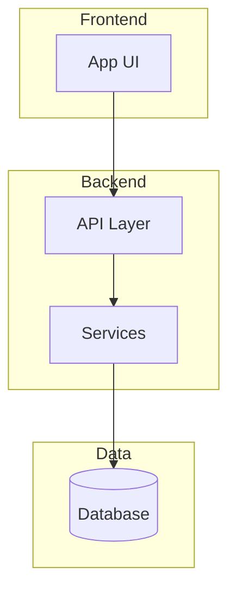

# Documentation Analyzer Skill

## When to Use
- Analyzing a codebase for documentation
- Generating README or API docs
- Understanding code structure and patterns
- Creating onboarding documentation

---

## Phase 1: Codebase Discovery
1. **Map Structure**: Identify modules, packages, entry points
2. **Dependency Analysis**: Trace imports and dependencies
3. **Pattern Recognition**: Identify design patterns and architecture

## Phase 2: Code Understanding

For each module: Purpose, Dependencies, Exports, Side Effects
For functions: Inputs, Outputs, Business logic, Edge cases
For classes: Responsibility, Public interfaces, Internal state, Interactions

## Phase 3: Documentation Generation

### README Structure
```markdown
# Project Name
## Overview
## Architecture (Mermaid diagram)
## Installation
## Usage (code examples)
## Configuration
## API Reference
## Development (contributing, tests)
```

### API Documentation Format
```markdown
## `function_name(param1: Type) -> ReturnType`
Brief description.
### Parameters
### Returns
### Raises
### Example
```

## Phase 4: Diagram Generation



---

## Checklist
- [ ] Project structure mapped
- [ ] All modules documented
- [ ] README generated
- [ ] API docs created
- [ ] Architecture diagram included
- [ ] Installation/setup instructions clear
- [ ] Code examples provided
