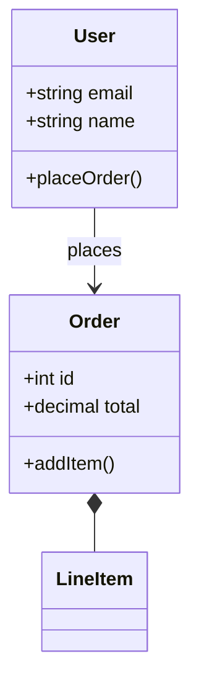
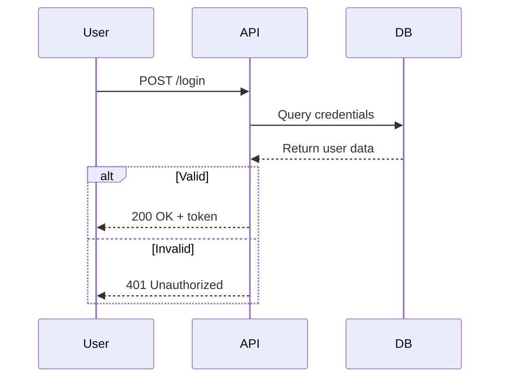
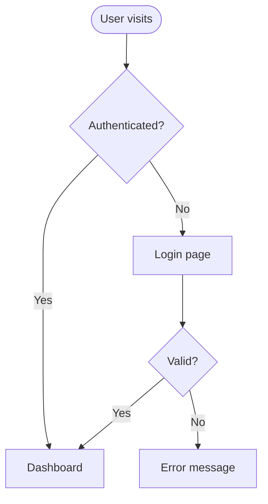
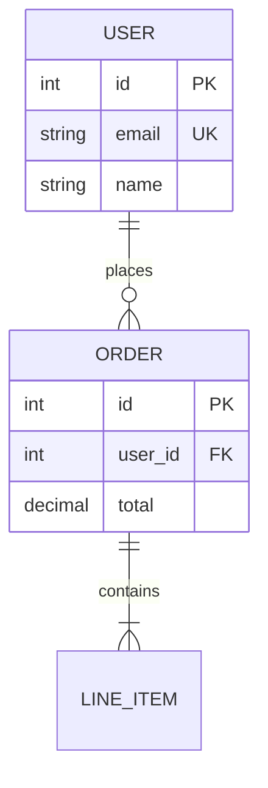
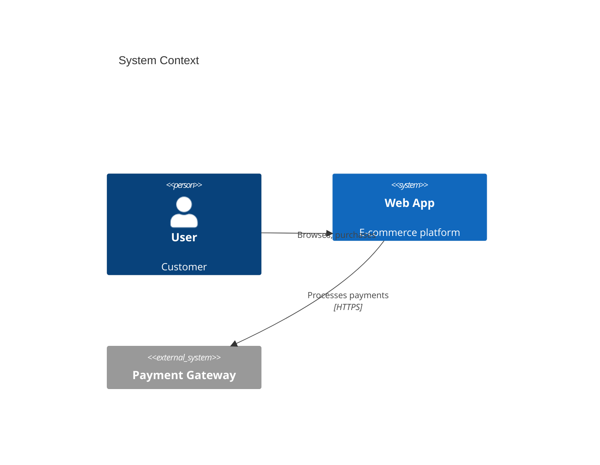
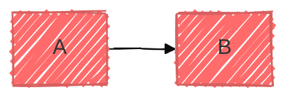

# Mermaid Diagramming

**Works with:** Any AI coding agent (Claude, Cursor, GitHub Copilot, Windsurf, etc.)

Create professional software diagrams using Mermaid's text-based syntax. Diagrams are version-controllable, easy to update, and render automatically in GitHub, GitLab, Notion, and more.

## Triggers

Use this skill when you need to:
- "diagram this", "visualize this", "model this"
- "show the flow", "map out the process"
- "architecture diagram", "class diagram", "sequence diagram"
- "database schema", "ERD", "entity relationship"
- "flowchart", "user journey", "system design"

## Quick Reference

| Diagram Type | Use For | Syntax Starts With |
|--------------|---------|-------------------|
| **Class Diagram** | Domain models, OOP design | `classDiagram` |
| **Sequence Diagram** | API flows, interactions | `sequenceDiagram` |
| **Flowchart** | Processes, algorithms, user journeys | `flowchart TD` or `flowchart LR` |
| **ERD** | Database schemas | `erDiagram` |
| **C4 Diagram** | Architecture (context, container, component) | `C4Context`, `C4Container`, `C4Component` |
| **State Diagram** | State machines, lifecycles | `stateDiagram-v2` |
| **Git Graph** | Branching strategies | `gitGraph` |
| **Gantt Chart** | Project timelines | `gantt` |

## Core Syntax Pattern

All Mermaid diagrams follow this structure:

```mermaid
diagramType
  definition content
```

**Key principles:**
- First line declares diagram type
- Use `%%` for comments
- Indentation improves readability
- Misspellings break diagrams; validate at [mermaid.live](https://mermaid.live)

## Quick Start Examples

### Class Diagram


### Sequence Diagram


### Flowchart


### ERD


### C4 Context


## Essential Syntax

### Relationships (Class/ERD)
```
-->   Association
..>   Dependency
--|>  Inheritance/Generalization
--*   Composition
--o   Aggregation
```

### Arrows (Sequence/Flowchart)
```
->>   Solid arrow (sync message)
-->>  Dashed arrow (response)
-->   Flowchart connection
```

### Node Shapes (Flowchart)
```
[]    Rectangle
()    Rounded
{}    Diamond (decision)
([])  Stadium/pill
[()]  Cylinder (database)
```

### Cardinality (ERD)
```
||--||  One to one
||--o{  One to many
}o--o{  Many to many
```

## Configuration

Add themes and styling:



**Themes:** default, forest, dark, neutral, base  
**Look:** classic, handDrawn

## Export & Rendering

**Auto-renders in:**
- GitHub/GitLab Markdown
- VS Code (with Mermaid extension)
- Notion, Obsidian, Confluence

**Export to PNG/SVG:**
- Online: [mermaid.live](https://mermaid.live)
- CLI: `npm install -g @mermaid-js/mermaid-cli`
  ```bash
  mmdc -i diagram.mmd -o diagram.png
  ```

## Best Practices

1. **Start simple** - Core elements first, add details incrementally
2. **One concept per diagram** - Split complex views into focused diagrams
3. **Use clear labels** - Meaningful names make diagrams self-documenting
4. **Comment extensively** - Use `%%` to explain complex parts
5. **Validate syntax** - Test at [mermaid.live](https://mermaid.live) before committing
6. **Version control** - Store `.mmd` files with code
7. **Keep updated** - Update diagrams when code changes

## Common Issues

**Diagram won't render:**
- Check for typos in diagram type declaration
- Validate syntax at [mermaid.live](https://mermaid.live)
- Avoid special characters in labels (use quotes if needed)

**Arrows not connecting:**
- Verify node IDs match exactly
- Check arrow syntax (`-->` vs `->>` vs `-->>`)

**Layout looks wrong:**
- Try different direction: `TD` (top-down), `LR` (left-right), `RL`, `BT`
- Use subgraphs to group related elements
- Consider splitting into multiple diagrams

## Detailed References

See `references/` for comprehensive syntax:

- **[class-diagrams.md](references/class-diagrams.md)** - Relationships, multiplicity, methods, domain modeling
- **[sequence-diagrams.md](references/sequence-diagrams.md)** - Messages, activations, loops, alt/opt blocks
- **[flowcharts.md](references/flowcharts.md)** - Shapes, subgraphs, styling, complex flows
- **[erd-diagrams.md](references/erd-diagrams.md)** - Entities, cardinality, keys, attributes
- **[c4-diagrams.md](references/c4-diagrams.md)** - Context, container, component levels
- **[architecture-diagrams.md](references/architecture-diagrams.md)** - Cloud services, infrastructure, deployment
- **[advanced-features.md](references/advanced-features.md)** - Themes, configuration, layout options
- **[workflows.md](references/workflows.md)** - Step-by-step examples
- **[troubleshooting.md](references/troubleshooting.md)** - Common problems and solutions
