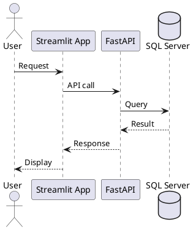
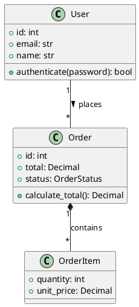
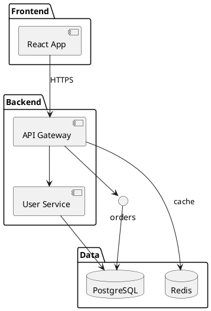
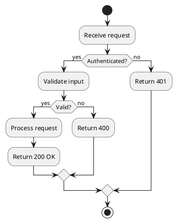
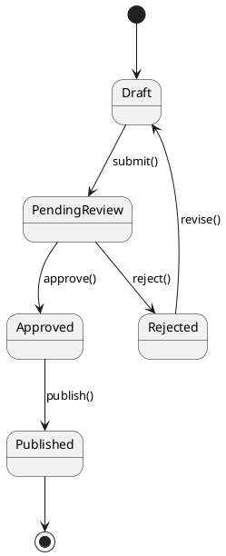
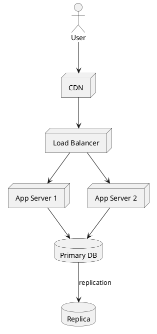

# PlantUML Diagram Generation

Generate PlantUML diagrams for architecture, API flows, and process visualization using project branding.

> **Project Context** — Read `project-config.md` in the repo root for brand tokens, color palette, and project metadata.

## Brand Theme

Use this block at the start of your `.puml` files for consistent brand styling:

```plantuml
@startuml
skinparam backgroundColor #F8F9FA
skinparam defaultFontSize 14
skinparam defaultFontColor #1F2937
skinparam rectangle {
  BackgroundColor #FFF7ED
  BorderColor #F97316
  FontColor #1F2937
}
skinparam participant {
  BackgroundColor #F0F9FF
  BorderColor #0EA5E9
}
skinparam database {
  BackgroundColor #ECFDF5
  BorderColor #10B981
}
skinparam arrow {
  Color #1F2937
}
skinparam arrowColor #E10A0A
' Use arrowColor for key flows; Color for default
@enduml
```

For **sequence diagrams**, you can add:

```plantuml
skinparam sequenceArrowColor #E10A0A
skinparam sequenceLifeLineBorderColor #1F2937
skinparam sequenceParticipantBackgroundColor #F8F9FA
skinparam sequenceParticipantBorderColor #E10A0A
```

## Standard Participants

When documenting systems, use consistent participant names where applicable:

| Participant   | Use case                |
|---------------|-------------------------|
| Streamlit App | Streamlit dashboards      |
| FastAPI       | API services              |
| SQL Server    | Data layer               |
| Redis / Cache | Caching layer           |
| User          | End user / operator     |

Example:



## Diagram Types

| Type       | Best For                           |
|------------|-------------------------------------|
| Sequence   | API calls, request/response flows  |
| Class      | OOP design, data models            |
| Component  | System architecture, microservices |
| Activity   | Workflows, business logic          |
| State      | State machines, lifecycles         |
| Deployment | Infrastructure, network topology   |

Use the brand theme above for all diagram types. Syntax reference follows.

### Class diagram



**Relationship arrows:**

| Arrow    | Meaning        |
|----------|----------------|
| `-->`    | Dependency     |
| `--`     | Association    |
| `*--`    | Composition    |
| `o--`    | Aggregation    |
| `<\|--`  | Inheritance    |
| `..\|>`  | Implementation |

### Component diagram (packages and dependencies)



### Activity diagram (flow and branches)



### State diagram



### Deployment diagram



## Generating Output

```bash
plantuml diagram.puml          # PNG (default)
plantuml -tsvg diagram.puml    # SVG
plantuml -txt diagram.puml     # ASCII art
plantuml -utxt diagram.puml    # Unicode ASCII
plantuml -tsvg diagrams/       # Batch process folder
plantuml -syntax diagram.puml  # Syntax check only
```

## Tips

1. Apply the brand theme block once per file.
2. Use Primary Red (#E10A0A) for primary flows or key components.
3. Keep participant labels short; use "Streamlit App", "FastAPI", "SQL Server" for project context.
4. Keep diagrams simple — 5–12 elements per diagram.
5. Use `left to right direction` for horizontal layouts.
6. Version control `.puml` files; they diff well.
