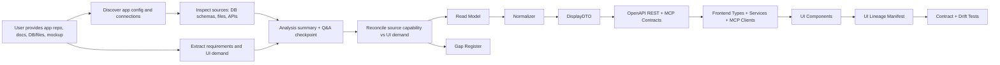

# Data Contract Pipeline

Use this skill to map DB tables, files, APIs, requirements, and UI mockups into a verified frontend data contract.

It helps you:

- Map DB tables/files/docs into UI safely.
- Generate read models, normalizers, DisplayDTOs, OpenAPI-first REST contracts, MCP-first contracts, frontend types, and services.
- Detect gaps between mockups, requirements, backend data, and final UI.
- Generate UI lineage so every production field can be traced back to source data.
- Catch drift when sources, DTOs, API responses, or frontend types change.

The skill is generic. Any app-specific DB, such as a CDR database, should be treated as an evaluation case or implementation input, not as hardcoded skill behavior.

---

## Key Principle

DB tables do not map directly to UI.

Requirements and UI demand decide what should be displayed. DBs, files, and APIs decide what can be displayed. The DisplayDTO is the contract between backend reality and frontend rendering.

The safe path is:

```text
Source -> Read Model -> Normalizer -> DisplayDTO -> OpenAPI REST + MCP Contracts -> Frontend Types -> UI -> Lineage
```

---

## How It Works



The skill asks questions after it has inspected the repo, docs, sources, and UI. This keeps the questions narrow and prevents guessing.

---

## How The User Uses It

Use natural language. These are good prompts:

```text
Use data-contract-pipeline for this app repo and this DB. Map the required UI fields and generate lineage.
```

```text
Use this skill to map this JSON/Markdown file into the UI and create DisplayDTOs and frontend types.
```

```text
Audit whether my mockup is backed by real data. Show mockup-only, required-unplaced, and blocked elements.
```

```text
Generate lineage for every UI field in this app.
```

```text
The app repo has the DB config. Discover it first, then ask me only for missing details.
```

The user should provide as many of these as they have:

- App repo path.
- DB/table/view names or file paths.
- Requirements docs, PRDs, tickets, or runbooks.
- UI mockup folder, HTML, JSX/TSX, or final frontend route files.
- Existing DTO/API/frontend type files if they exist.

If credentials are missing, the skill first searches app config and then asks for only the missing values.

---

## Stages

1. **Intake**: collect app repo, source inputs, requirements, and UI inputs.
2. **Connection Discovery**: find DB/file/API config in the app repo and mask secrets.
3. **Source Discovery**: inspect DB schemas, files, APIs, samples, and existing DTOs.
4. **Requirements and UI Demand Extraction**: extract what the product and UI need.
5. **Analysis Summary + Q&A**: ask up to 3 high-impact questions after discovery.
6. **Reconciliation**: compare source capability against requirements and UI demand.
7. **Read Model + DTO Design**: define adapter/read model, normalizer, DisplayDTO, API, and frontend types.
8. **Lineage Generation**: trace each UI field back to source object/field and transform.
9. **Validation**: run drift checks, type alignment, query smoke tests, and lineage coverage.

---

## Status Classes

Every UI/data item should receive one status:

| Status | Meaning |
|--------|---------|
| `contract-backed` | Verified source, transform, DTO/API, and UI placement exist. |
| `required-unplaced` | Required by docs/backend but missing from mockup/final UI placement. |
| `source-capability-only` | Source has the data, but no requirement/UI demand uses it. |
| `mockup-only` | Present in mockup/demo data, but not part of the backed production UI unless promoted by the user. |
| `partially-backed` | Some fields map, but source, formula, state, or freshness is incomplete. |
| `blocked` | Cannot map safely because of missing credentials, source, formula, or safe query. |
| `deferred` | Explicitly out of current release scope. |

These statuses prevent demo mockups and raw backend fields from becoming production contracts by accident.

---

## Missing UI Handling

When requirements or backend data demand a UI element that is absent from the mockup:

1. Mark it `required-unplaced`.
2. Create `ui_gap_brief.md`.
3. Include requirement/source evidence, proposed page, component type, DisplayDTO fields, and acceptance criteria.
4. Ask the user/product owner to accept placement or defer it.

Do not silently place the element in a random screen.

When the mockup has a UI element with no requirement or source:

1. Mark it `mockup-only`.
2. Do not create production REST or MCP endpoints for it.
3. Consult the user and either remove it from the production UI, replace it with a data-backed element, or promote it by adding a requirement and source contract.

Most creative mockup-only elements should be removed or replaced, not marked deferred. Use `deferred` only when the user explicitly says the feature is intended for a later release.

---

## Standard Outputs

The workflow can emit:

- `connection_manifest.json`
- `source_manifest.json`
- `requirements_manifest.json`
- `ui_demand_manifest.json`
- `contract_decisions.json`
- `read_catalog.json`
- `openapi_contract.yaml`
- `mcp_contract.json`
- `mapping_manifest.json`
- `lineage_manifest.json`
- `gap_register.json`
- `ui_gap_brief.md`

Not every run needs every artifact. Audit runs usually produce manifests and reports. Build runs also produce DTOs, API routes, frontend types, services, and tests.

---

## Script Reference

Existing low-level helpers:

- `extract_schema.py`: extract schema from JSON, Markdown, CSV, XLSX, YAML, text, or DB metadata.
- `drift_check.py`: compare payload, ingestion model, and DisplayDTO.
- `ts_dto_compare.py`: compare frontend TypeScript types to Python DTOs.
- `generate_mapping_doc.py`: generate or check field mapping documentation.

Workflow helpers:

- `discover_connections.py`: find DB/file/API connection config in app repos.
- `discover_sources.py`: inspect source files or DB metadata and emit `source_manifest.json`.
- `extract_requirements.py`: parse docs and markdown into requirement demand.
- `extract_ui_demand.py`: parse HTML/JSX/TSX/routes/mockup files into UI demand.
- `reconcile_contract.py`: compare requirements, UI demand, and source capability.
- `compile_read_catalog.py`: scaffold safe read model/query catalog.
- `generate_api_contracts.py`: scaffold OpenAPI-first REST and MCP-first service contracts from the read catalog.
- `validate_lineage.py`: verify production UI fields have lineage.
- `generate_gap_report.py`: produce `gap_register.json` and `ui_gap_brief.md`.

Example:

```bash
python .github/skills/workflow/data-contract-pipeline/scripts/discover_connections.py \
  --app E:/Projects/my-app \
  --output artifacts/data-contract/connection_manifest.json

python .github/skills/workflow/data-contract-pipeline/scripts/extract_ui_demand.py \
  --ui E:/Projects/my-app/frontend/src \
  --output artifacts/data-contract/ui_demand_manifest.json

python .github/skills/workflow/data-contract-pipeline/scripts/reconcile_contract.py \
  --sources artifacts/data-contract/source_manifest.json \
  --requirements artifacts/data-contract/requirements_manifest.json \
  --ui-demand artifacts/data-contract/ui_demand_manifest.json \
  --output artifacts/data-contract/mapping_manifest.json \
  --gaps artifacts/data-contract/gap_register.json

python .github/skills/workflow/data-contract-pipeline/scripts/compile_read_catalog.py \
  --mapping artifacts/data-contract/mapping_manifest.json \
  --output artifacts/data-contract/read_catalog.json

python .github/skills/workflow/data-contract-pipeline/scripts/generate_api_contracts.py \
  --read-catalog artifacts/data-contract/read_catalog.json \
  --openapi artifacts/data-contract/openapi_contract.yaml \
  --mcp artifacts/data-contract/mcp_contract.json
```

---

## Enterprise Pattern Check

This workflow is directionally aligned with how mature product/data/platform teams handle data-to-UI work:

- Consumer-driven contracts: UI/API needs are explicit.
- DTO/read-model boundaries: raw DB and vendor schemas do not leak into UI.
- Typed APIs and frontend types: generated or checked.
- OpenAPI-first REST and MCP-first endpoints: app data can be consumed by other apps and MCP clients.
- Data lineage: every displayed field has a traceable source.
- Contract tests: drift is caught before release.
- Gap register: product/design/backend mismatches are visible.

Large organizations may also use GraphQL schemas, OpenAPI codegen, dbt semantic layers, data catalogs, schema registries, and internal developer portals. This skill plus deterministic scripts is the practical, app-by-app version.

---

## Landmines

- Secret leakage: never print passwords, tokens, or full connection strings.
- SQL performance: avoid unbounded aggregation on large LIVE tables.
- PII exposure: classify MSISDN, IMSI, email, customer IDs, names, and account IDs.
- Mockup hallucination: demo data is not a production contract.
- Backend overexposure: do not expose DB-only fields just because they exist.
- Metric ambiguity: define formula, grain, timezone, unit, null semantics, and freshness.
- Date/time drift: decide timezone and reporting grain.
- Currency/units drift: define cents vs euros, bytes vs MB/GB, percentages vs fractions.
- Null semantics: distinguish zero, null, missing, unavailable, and not applicable.
- Auth drift: app config may be stale; test and report actual connection mode.
- Schema doc drift: live schema can differ from docs.
- Service contract sprawl: do not expose every read model as public REST/MCP; expose only approved, backed, permissioned capabilities.
- MCP security: tools/resources must define auth, PII classification, rate limits, and read/write behavior.
- Small-model fragility: keep stage artifacts and statuses explicit.
